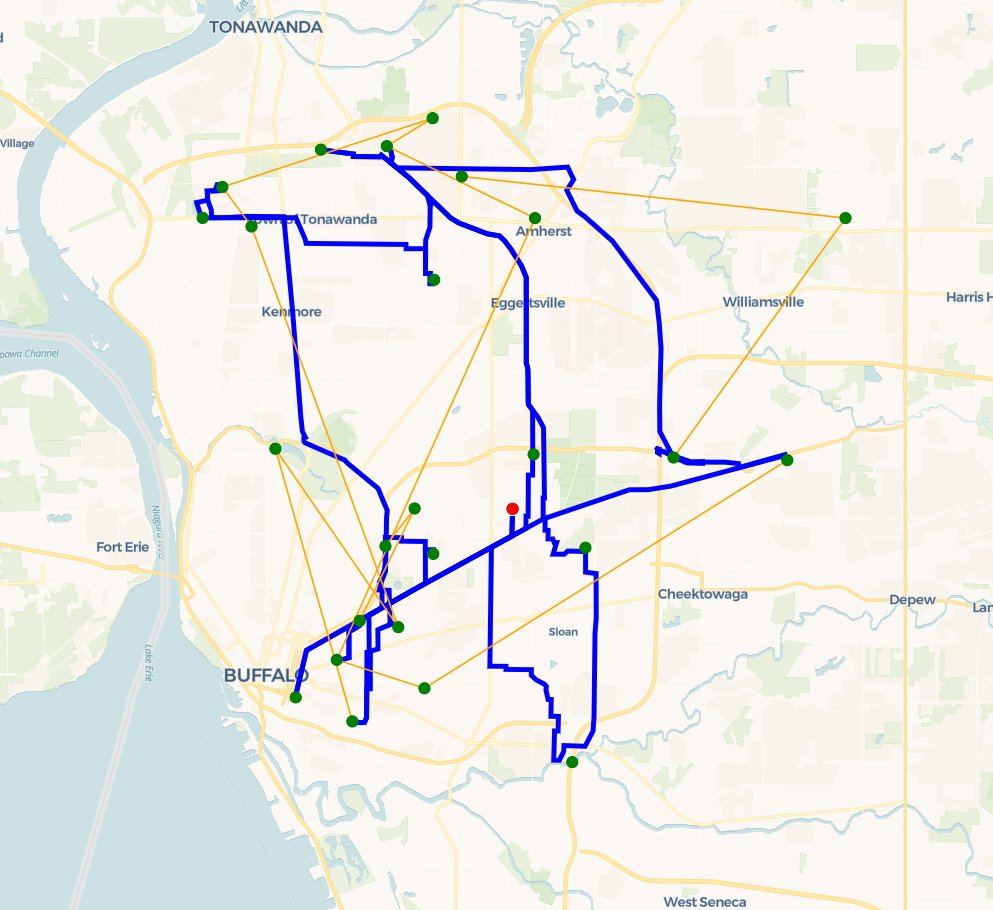

# The truck and drone delivery problem (FSTSP, TSP-D)

This repository is my implementation of several algorithms solving the truck-drone delivery problem:

- FSTSP_heuristic described in the paper *[Murray and Chu. "The flying sidekick traveling salesman problem: Optimization of drone-assisted parcel delivery", in Transportation Research Part C: Emerging Technologies. 2015](https://doi.org/10.1016/j.trc.2015.03.005)*.

    - TSP solvers used for FSTSP heuristic has two options:
      - [Google OR-Tools](https://developers.google.com/optimization)
      - Two-opt heuristic

- CP-ACO implemented based on the proposed heuristic on *[D. N. Das, R. Sewani, J. Wang and M. K. Tiwari, "Synchronized Truck and Drone Routing in Package Delivery Logistics," in IEEE Transactions on Intelligent Transportation Systems. 2021](https://doi.org/10.1109/TITS.2020.2992549)*

- Dynamic Programming proposed on *[Bouman, Paul, Niels Agatz, and Marie Schmidt. "Dynamic programming approaches for the traveling salesman problem with drone." Networks 72.4 (2018)](https://doi.org/10.1002%2Fnet.21864)*

## How to Run

```bash
python3 main.py --algorithm="algorithm_name"
```
Check `main.py` for the list of algorithm name

### Configuration

- Algorithm parameters can be adjusted in the `config.yaml` file.


## Test Cases

- Test files are constructed with the structure from [https://github.com/optimatorlab/mFSTSP](https://github.com/optimatorlab/mFSTSP/tree/master/Problems).
- You may also run the algorithm with a custom list of latitude, longitude, and parcel weight inputs. Refer to the folder `my_test` for example.

## Results
<table>
  <tr>
    <td align="center">
      <br>
      <em>Figure 1: Results of TSP in 25 customers test</em>
    </td>
    <td align="center">
      <br>
      <em>Figure 3: Results of FSTSP_heuristic in 25 customers test</em>
    </td>
  </tr>
</table>
<table>
  <tr>
    <td align="center">
      <br>
      <em>Figure 2: Results of CP-ACO in 25 customers test</em>
    </td>
    <td align="center">
      <br>
      <em>Figure 4: Results of dynamic programming in 8 customers test</em>
    </td>
  </tr>
</table>


## Requirements

- `python` (>=3.6)
- `osmnx`
- `networkx`
- `numpy`
- `pandas`
- `ortools`

## Author
👩🏻‍💻 Thi Thuy Ngan Duong
